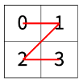
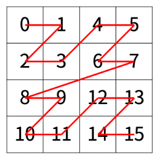
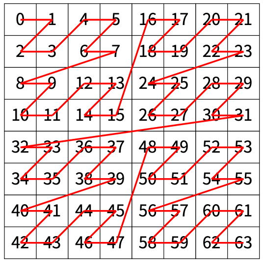

# [BOJ] 1074 - Z (Java)

## 🔗 문제 링크
[백준 1074번: Z](https://www.acmicpc.net/problem/1074)


---
## 📊 성능 분석 (Performance)

| 메모리 (Memory) | 시간 (Time) | 언어 (Language) | 코드 길이 (Code Length) |
| :---: | :---: | :---: | :---: |
| **14340 KB** | **100 ms** | **Java 11** | **966 B** |


## 📌 문제 개요
<h2>문제</h2>

<p>
한수는 크기가 2<sup>N</sup> × 2<sup>N</sup>인 2차원 배열을 Z모양으로 탐색하려고 한다.
</p>

<p>
예를 들어, 2×2 배열을 왼쪽 위칸, 오른쪽 위칸, 왼쪽 아래칸, 오른쪽 아래칸 순서대로 방문하면 Z모양이다.
</p>



<p>
N &gt; 1인 경우, 배열을 크기가 2<sup>N-1</sup> × 2<sup>N-1</sup>로 4등분 한 후에 재귀적으로 순서대로 방문한다.
</p>

<p>
다음 예는 2<sup>2</sup> × 2<sup>2</sup> 크기의 배열을 방문한 순서이다.
</p>


<p>
N이 주어졌을 때, r행 c열을 몇 번째로 방문하는지 출력하는 프로그램을 작성하시오.
</p>

<p>
다음은 N=3일 때의 예이다.
</p>


<h2>문제</h2>
<p>첫째 줄에 정수 N, r, c가 주어진다.</p>
<h2>문제</h2>
<p>r행 c열을 몇 번째로 방문했는지 출력한다.</p>

## 💡 해결 프로세스

 0. 분할정복 재귀의 상태 : 도달하고 싶은 (혹은 상대적인)위치 ,한 변의 크기 
 1. 공간을 4분할 하면 좌상단 영역과 나머지 영역이 같은 규칙이 적용되므로 영역 밖에 있다면 위치에 따라 영역 크기 배수 값을 구하고  상대적 방문 순서를 더한값을 구한다.
 2. 상대적 위치 혹은 영역안에 좌상단 영역 안에 있는 값은 분할정복(재귀)로 구한다. 리턴값은 재귀값 + 위치에 따라 영역 크기 배수 값이다.
 3. 종료 조건에 도달할 때까지 위1,2 번을 반복한다. 종료조건은 영역이 더이상 쪼개질 수 없는 조건, 한 변의 크기가 1일때이다.(return값은 0) 크기가 2일때 +1 or +2 or +3
---

## 💻 코드 구조 상세 (Core Logic)


🔍 분할정복 구현 구현
```Java
     static int dq(int r, int c, int s) {
        int ret = 0 ;
        if(ans != -1 )return 0;
        if( s == 1 )  return 1;
        int half = s >>1;
        int val =half*half;
        if( r <half && c>=half) ret+= val;
        if( r >=half && c<half) ret+= val*2;
        if( r >=half && c>=half) ret+= val*3;
        int newR = (r>=half)? r-half: r;
        int newC = (c>=half)? c-half: c;
        ret += dq(newR,newC, half);
        return ret ;

    }
```

🔍 세팅(사전 준비)
```Java
   public static void main(String[] args) throws Exception {
        StringTokenizer st ;
        BufferedReader br = new BufferedReader(new InputStreamReader (System.in));
        st = new StringTokenizer( br.readLine());
        N = Integer.parseInt(st.nextToken());
        R = Integer.parseInt(st.nextToken());
        C = Integer.parseInt(st.nextToken());
        ans = dq(R,C, 1<<N )-1;
        System.out.print(ans);
        // TODO Auto-generated method stub
    }
```


---
⚠️ 주의 및 회고
4개의 영역을 진짜로 나눠석 top-down으로 더해나가면 시간초과난다. smart하게 상대적인 위치 개념을 이해하는것이 좋겠다.
