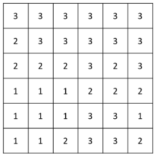
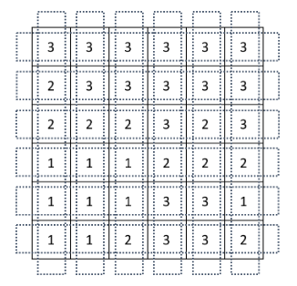
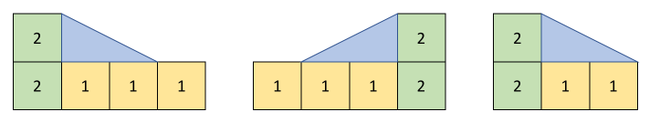
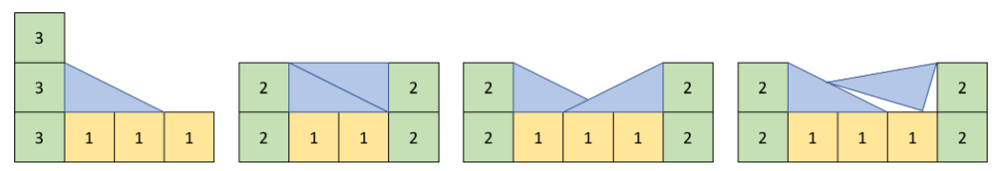
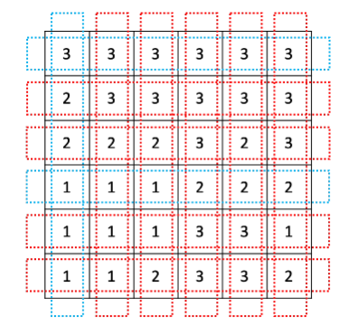

# [BOJ] 14890 - 경사로 (Java)

## 🔗 문제 링크
[백준 14890번: 경사로](https://www.acmicpc.net/problem/14890)


---
## 📊 성능 분석 (Performance)

| 메모리 (Memory) | 시간 (Time) | 언어 (Language) | 코드 길이 (Code Length) |
| :---: | :---: | :---: | :---: |
| **14972 KB** | **128 ms** | **Java 11** | **1612 B** |


## 📌 문제 개요
<h2>문제</h2>
<hr>
<pre>
크기가 N×N인 지도가 있다. 지도의 각 칸에는 그 곳의 높이가 적혀져 있다.

오늘은 이 지도에서 지나갈 수 있는 길이 몇 개 있는지 알아보려고 한다. 길이란 한 행 또는 한 열 전부를 나타내며, 한쪽 끝에서 다른쪽 끝까지 지나가는 것이다.

다음과 같은 N=6인 경우 지도를 살펴보자.
</pre>



<p>
이때, 길은 총 2N개가 있으며, 아래와 같다.
</p>


<p>
길을 지나갈 수 있으려면 길에 속한 모든 칸의 높이가 모두 같아야 한다. 또는, 경사로를 놓아서 지나갈 수 있는 길을 만들 수 있다. 경사로는 높이가 항상 1이며, 길이는 L이다. 또, 개수는 매우 많아 부족할 일이 없다. 경사로는 낮은 칸과 높은 칸을 연결하며, 아래와 같은 조건을 만족해야한다.
</p>

<h2> 경사로 조건</h2>
<ul>
  <li>경사로는 낮은 칸에 놓으며, L개의 연속된 칸에 경사로의 바닥이 모두 접해야 한다.</li>
  <li>낮은 칸과 높은 칸의 높이 차이는 1이어야 한다.</li>
  <li>낮은 칸에 설치해야 한다</li>
  <li>경사로를 놓을 낮은 칸의 높이는 모두 같아야 하고, L개의 칸이 연속되어 있어야 한다.</li>
</ul>

<p> 아래와 같은 경우에는 경사로를 놓을 수 없다.</p>
<ul>
  <li>경사로를 놓은 곳에 또 경사로를 놓는 경우</li>
  <li>낮은 칸과 높은 칸의 높이 차이가 1이 아닌 경우</li>
  <li>낮은 지점의 칸의 높이가 모두 같지 않거나, L개가 연속되지 않은 경우</li>
  <li>경사로를 놓다가 범위를 벗어나는 경우</li>
</ul>
<p>L = 2인 경우에 경사로를 놓을 수 있는 경우를 그림으로 나타내면 아래와 같다.</p>



<p>경사로를 놓을 수 없는 경우는 아래와 같다.</p>



<pre>
위의 그림의 가장 왼쪽부터 1번, 2번, 3번, 4번 예제라고 했을 때, 1번은 높이 차이가 1이 아니라서, 2번은 경사로를 바닥과 접하게 놓지 않아서, 3번은 겹쳐서 놓아서, 4번은 기울이게 놓아서 불가능한 경우이다.

가장 위에 주어진 그림 예의 경우에 지나갈 수 있는 길은 파란색으로, 지나갈 수 없는 길은 빨간색으로 표시되어 있으며, 아래와 같다. 경사로의 길이 L = 2이다.
</pre>



<p>지도가 주어졌을 때, 지나갈 수 있는 길의 개수를 구하는 프로그램을 작성하시오.</p>
<hr>
<h2>입력</h2>
<p>첫째 줄에 N (2 ≤ N ≤ 100)과 L (1 ≤ L ≤ N)이 주어진다. 둘째 줄부터 N개의 줄에 지도가 주어진다. 각 칸의 높이는 10보다 작거나 같은 자연수이다.</p>
<hr>
<h2>출력</h2>
<p>r첫째 줄에 지나갈 수 있는 길의 개수를 출력한다.</p>
<hr>

## 💡 해결 프로세스

 1. row와 col을 모두 검사하는 조건이 있으므로 transpos 배열을 이용해 row 기준으로만 검사한다.
 2. 이전 영역과 같은 높이의 영역을 조사하고 있다면  sameHeight 변수에 누적한다.
 2. sameHeight 변수는 '이전 높이보다 높은 경우', 공사할 수 있는 영역을 의미한다. (높이는 1차이, 영역은 주어진 크기 이상) 
 3. '이전영역보다 현재 영역이 낮은 경우', 현재 위치에서 연속된 다음 영역들이 현재 높이와 같은지 주언진 영역의 길이만큼 검사한다. 현재위치를 마지막 검사위치로 바꾸고 sameHeight는 0으로 초기화한다(뒤로 경사로 못깐다.) 
---

## 💻 코드 구조 상세 (Core Logic)


🔍 분할정복 구현 구현
```Java
    //row 기준으로 search
    static boolean checkR(int[][] area, int r ) {
        int prev = area[r][0];
        int sameHeight = 1;
        for(int c = 1 ;c<n ;++c) {
            int now = area[r][c];
            if(now == prev) ++sameHeight;
            else if( now - 1 == prev&& sameHeight >= len) sameHeight = 1;
            else if( now + 1 == prev) {
                int rep =len;
                if( len -1 + c >= n)return false;
                while(rep-->0) {
                    if( area[r][c] != area[r][c +rep]) return false;
                }
                c += len-1;
                sameHeight= 0;
            }
            else return false;
            prev =now;
        }
        return true;
    }
    //모든 영역 검사
     static void Search(int[][] area) {
        for(int i = 0 ; i < n ; ++i) {
            if(checkR(area, i)==true)
                ++ans;
        }
    }
```

🔍 세팅(사전 준비)
```Java
  public static void main(String[] args) throws Exception {
        StringTokenizer st ;
        BufferedReader br = new BufferedReader(new InputStreamReader (System.in));
        st = new StringTokenizer( br.readLine());
        n = Integer.parseInt(st.nextToken());
        len = Integer.parseInt(st.nextToken());
        area1 = new int[n][n];
        area2 = new int[n][n];
        for(int i = 0 ;i< n;++i) {
            st = new StringTokenizer(br.readLine());
            for(int j  =0 ; j< n;++j) {
                area1 [i][j] = Integer.parseInt(st.nextToken());
                area2 [j][i] =area1 [i][j] ;
            }
        }
        Search(area1);
        Search(area2);


        System.out.print(ans);


        // TODO Auto-generated method stub

    }
```


---
⚠️ 주의 및 회고
현제 놆이가 이전 높이보다 낮을 때 smeHeight에서 len 길이만큼 빼고, sameHeight가 음수라면 경사로 설치를 못하게 하면 간단히 짤 수 있었다. 음수일때 경사로를 놔야한다면 실패한다.   
