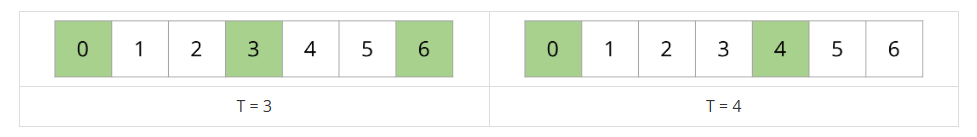
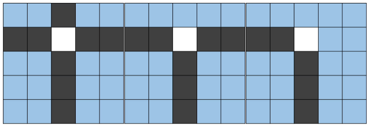

# [BOJ] 16137 - 견우와 직녀 (Java)

## 🔗 문제 링크
[백준 16137: 견우와 직녀](https://www.acmicpc.net/problem/16137)


---
## 📊 성능 분석 (Performance)

| 메모리 (Memory) | 시간 (Time) | 언어 (Language) | 코드 길이 (Code Length) |
| :---: | :---: | :---: | :---: |
| **14164 KB** | **104 ms** | **Java 11** | **2236 B** |


## 📌 문제 개요
<h2>문제</h2>
<hr>
<pre>
견우와 직녀는 여러 섬과 절벽으로 이루어진 지역에서 살고 있다. 이 지역은 격자로 나타낼 수 있으며, 상하좌우로 인접한 칸으로 가는 데 1분이 걸린다.

7월 7일은 견우와 직녀가 오작교를 건너 만날 수 있는 날이다. 그런데 고령화로 인해서 까마귀와 까치가 예전처럼 커다란 오작교를 만들 수 없다. 그래서 요즘은 일부 절벽에만 다리를 만들어 주고 있고, 그마저도 힘들어서 몇 분 주기로 오작교를 짓고 해체하는 작업을 반복해야 한다. 한 번 지은 오작교는 1분 동안 유지할 수 있다.

예를 들어 오작교가 3분과 4분 주기라면, 건널 수 있는 시간은 아래 그림에서 초록색으로 표시한 부분과 같다.
</pre>



<pre>
오작교는 이처럼 매우 불안정하므로, 견우는 안전을 위해 두 번 연속으로 오작교를 건너지는 않기로 했다.

까마귀와 까치는 조금이라도 견우를 더 도와주기 위해, 절벽을 정확히 하나 골라 주기가 M분인 오작교를 하나 더 놓아 주기로 했다. 단, 이미 오작교를 짓기로 예정한 절벽에는 오작교를 하나 더 놓을 수 없고, 아래와 같이 절벽이 가로와 세로로 교차하는 곳에도 오작교를 놓을 수 없다.

아래 그림에서 파란색은 견우가 건널 수 있는 일반적인 땅, 검은색은 절벽, 흰색은 절벽이 교차해서 오작교를 놓을 수 없는 위치를 나타낸다.
</pre>



<p>견우가 직녀에게 도착할 수 있는 최소의 시간을 찾아 보자.</p>

<hr>
<h2>입력</h2>
<pre>
첫째 줄에 지형의 행과 열의 크기를 나타내는 정수 N (2 ≤ N ≤ 10)과 새로 만들어지는 오작교의 주기를 의미하는 정수 M(2 ≤ M ≤ 20)이 주어진다.

다음 N개의 줄에는 줄마다 배열의 각 행을 나타내는 N개의 정수가 한 개의 빈칸을 사이에 두고 주어진다. 각 칸에 들어가는 값은 0 이상 20 이하이다.

또한, 각 칸에 들어가는 정수의 의미는 다음과 같다.
</pre>

<ul>
	<li>
		1: 이동할 수 있는 일반적인 땅
	</li>
	<li>
		0: 건널 수 없는 절벽
	</li>
	<li>
		2 이상의 수: 적혀있는 수 만큼의 주기를 가지는 오작교
	</li>
</ul>

<pre>견우의 시작점은 지형의 맨 왼쪽 위 (0, 0) 이고, 직녀가 사는 곳은 지형의 맨 오른쪽 아래인 (N-1, N-1)이다. 견우가 시작점에서 출발하는 시간은 0분이다. 견우와 직녀가 사는 곳은 일반적인 땅이다.

견우와 직녀가 무조건 만날 수 있는 경우만 주어진다. 또한, 주어지는 지형 정보에서 오작교를 반드시 하나 이상 놓을 수 있다. 절벽이 가로와 세로로 교차하는 지점에는 오작교가 설치되어 있지 않다.</pre>
<hr>
<h2>출력</h2>
<p>견우가 직녀에게 갈 수 있는 최소의 시간을 출력한다.</p>
<hr>

## 💡 해결 프로세스

 1. (0,0) 위치에서 (n-1,n-1)취치까지 도달하기위해 해당 위치에 도달하기위한 시간을 이전 위치를 기반으로 구하고 저장한다. 
 2. 현재 상태까지 오기위한 요구 시간을 저장해놓고 다른 경로에서 현재상태로 오기위한 시간과 비교하며 최솟값을 유지하고 가지치기한다.  
 3. 오작교의 주기에 맞춰 정확히 오작교 '위'에 위치해야 한다. 
 4. dfs 작업을 마치고 [n-1][n-1]위치의 값을 출력한다.
 5. 길건너는 경우, 오작교를 건너는 경우를 구분해서 로직을 구성한다.
---

## 💻 코드 구조 상세 (Core Logic)
🔍 연속된 시계방향을 조사, ㄱ자로 배치된 계곡이 둘 다 0이라면 오작교 설치 못한다. 
```Java
static boolean check(int r,int c) {
		boolean ret = false;
		for (int d = 0; d < 4; ++d) {
			int nxtr = r + dr[(d + 1) % 4];
			int nxtc = c + dc[(d + 1) % 4];
			int nowr = r + dr[d];
			int nowc = c + dc[d];
			if (nxtr < 0 || nxtr >= N || nxtc < 0 || nxtc >= N)
				continue;
			if (nowr < 0 || nowr >= N || nowc < 0 || nowc >= N)
				continue;
			if (!(map[nxtr][nxtc] == 0 && map[nowr][nowc] == 0))
				continue;
			ret = true;
			break;
		}
		return ret;
	}

```
🔍 백트래킹+ 상태 전달(메모)
```Java
    static void dfs(int r, int c, int nowTime, int numBridges) {

		if (dist[r][c] <= nowTime)
			return;
		dist[r][c] = Math.min(dist[r][c], nowTime);
		for (int d = 0; d < 4; ++d) {
			int nr = r + dr[d];
			int nc = c + dc[d];
			int nowBridges = numBridges;
			int dur = -1;
			int nextTime = nowTime;
			if (nr < 0 || nr >= N || nc < 0 || nc >= N) continue;
			//오작교는 연속으로 건너지 않는다.-* 미리 걸러서 오작교 로직 편리하게 *
			if (map[r][c] != 1 && map[nr][nc] != 1) continue;
			//그냥 길이면 +1만큼 시간 추가
			if (map[nr][nc] == 1) {
				nextTime = nowTime + 1;
			}
			//길이 아닌 오작교 건너는 경우
			//길->오작교
			else if (map[r][c]==1 && map[nr][nc] > 1) {
				dur = map[nr][nc];
			}
			//오작교 만들 기회가 없고 계곡
			else if (nowBridges == 0 && map[nr][nc] == 0)
				continue;
			//오작교 만들수 있는 경우 + 위치도 적당 Check
			else if (nowBridges == 1 && map[nr][nc] == 0) {
				if(check(nr,nc)==true)continue;
				nowBridges--;
				dur = M;
			}
			//오작교 건너기 전에 기다리는 시간 기록 
			// (딱 위에 [r][c]==주기라면 다음에준 주기+1이므로 [nr][nc]=다음 주기에)
			if (dur != -1) {
				nextTime =(nowTime / dur + 1) * dur;
			}
			dfs(nr, nc, nextTime, nowBridges);
		}
	}
```
🔍 세팅(사전 준비)
```Java
public class Main {
	static int[] start = new int[2];
	static int[] end = new int[2];
	static int C ; 
	static int R ;
	static char[][] map;
	static boolean[][] vis ; 
	static int []dr = {0,0,1,-1};
	static int []dc = {1,-1,0,0};
	static int ans = Integer.MAX_VALUE;
	static int[][][] memo; 
	public static void main(String[] args) throws Exception {
			BufferedReader br = new BufferedReader(new InputStreamReader(System.in));
			StringTokenizer st= new StringTokenizer( br.readLine());
			C = Integer.parseInt(st.nextToken());
			R = Integer.parseInt(st.nextToken());
			map = new char[R][C];
			vis  = new boolean [R][C];
			memo = new int [R][C][4];
			start[0]=-1;
			end[0]=-1;
			for(int r = 0 ;r<R;++r) {
				String line = br.readLine();
				for(int c = 0 ;c<C;++c) {
					Arrays.fill( memo[r][c],Integer.MAX_VALUE);
					map[r][c] = line.charAt(c); 
					if(map[r][c] != 'C')continue;
					if(start[0]==-1)
					{
						start[0]= r; start[1]=c;
					}
					else {
						end[0]= r; end[1]=c;
					}
					
				}
			}
			dfs(start[0],start[1],0,-1);
			System.out.print(ans+"");
			
			
		}
	}

```

⚠️ 주의 및 회고
연속된 경우를 사전에 배제하고 넘기면 조건식이 더 쉬워진다., ㄱ자 조사만해도 오작교 설치 조건을 확인할 수 있다.  
