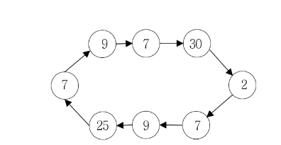

# [BOJ] 2531 - 회전 초밥 (Java)

## 🔗 문제 링크
[백준 2531: 회전 초밥](https://www.acmicpc.net/problem/2531)


---
## 📊 성능 분석 (Performance)

| 메모리 (Memory) | 시간 (Time) | 언어 (Language) | 코드 길이 (Code Length) |
| :---: | :---: | :---: | :---: |
| **18544 KB** | **180 ms** | **Java 11** | **1237 B** |


## 📌 문제 개요
<h2>문제</h2>
<hr>
<pre>
회전 초밥 음식점에는 회전하는 벨트 위에 여러 가지 종류의 초밥이 접시에 담겨 놓여 있고, 손님은 이 중에서 자기가 좋아하는 초밥을 골라서 먹는다. 초밥의 종류를 번호로 표현할 때, 다음 그림은 회전 초밥 음식점의 벨트 상태의 예를 보여주고 있다. 벨트 위에는 같은 종류의 초밥이 둘 이상 있을 수 있다.
</pre>


<p>새로 문을 연 회전 초밥 음식점이 불경기로 영업이 어려워서, 다음과 같이 두 가지 행사를 통해서 매상을 올리고자 한다.</p>
<ul>
	<li>
		원래 회전 초밥은 손님이 마음대로 초밥을 고르고, 먹은 초밥만큼 식대를 계산하지만, 벨트의 임의의 한 위치부터 k개의 접시를 연속해서 먹을 경우 할인된 정액 가격으로 제공한다.
	</li>
	<li>
		각 고객에게 초밥의 종류 하나가 쓰인 쿠폰을 발행하고, 1번 행사에 참가할 경우 이 쿠폰에 적혀진 종류의 초밥 하나를 추가로 무료로 제공한다. 만약 이 번호에 적혀진 초밥이 현재 벨트 위에 없을 경우, 요리사가 새로 만들어 손님에게 제공한다.
	</li>
</ul>
<pre>
위 할인 행사에 참여하여 가능한 한 다양한 종류의 초밥을 먹으려고 한다. 위 그림의 예를 가지고 생각해보자. k=4이고, 30번 초밥을 쿠폰으로 받았다고 가정하자. 쿠폰을 고려하지 않으면 4가지 다른 초밥을 먹을 수 있는 경우는 (9, 7, 30, 2), (30, 2, 7, 9), (2, 7, 9, 25) 세 가지 경우가 있는데, 30번 초밥을 추가로 쿠폰으로 먹을 수 있으므로 (2, 7, 9, 25)를 고르면 5가지 종류의 초밥을 먹을 수 있다.

회전 초밥 음식점의 벨트 상태, 메뉴에 있는 초밥의 가짓수, 연속해서 먹는 접시의 개수, 쿠폰 번호가 주어졌을 때, 손님이 먹을 수 있는 초밥 가짓수의 최댓값을 구하는 프로그램을 작성하시오.
</pre>

<hr>
<h2>입력</h2>
<p>첫 번째 줄에는 회전 초밥 벨트에 놓인 접시의 수 N, 초밥의 가짓수 d, 연속해서 먹는 접시의 수 k, 쿠폰 번호 c가 각각 하나의 빈 칸을 사이에 두고 주어진다. 단, 2 ≤ N ≤ 30,000, 2 ≤ d ≤ 3,000, 2 ≤ k ≤ 3,000 (k ≤ N), 1 ≤ c ≤ d이다. 두 번째 줄부터 N개의 줄에는 벨트의 한 위치부터 시작하여 회전 방향을 따라갈 때 초밥의 종류를 나타내는 1 이상 d 이하의 정수가 각 줄마다 하나씩 주어진다.</p>
<hr>
<h2>출력</h2>
<p>주어진 회전 초밥 벨트에서 먹을 수 있는 초밥의 가짓수의 최댓값을 하나의 정수로 출력한다.</p>
<hr>

## 💡 해결 프로세스

 1. 투포인터로 해결하낟.
 2. 0~K까지의 초밥 누적 개수와 타입의 개수를 기록한다.
 3. left==0~n-1 하면 오른쪽으로 k 개만큼 검사하며,  left 이동전에 초밥 제거 후 해당 초밥의 누적 개수가 0개라면 타입을 1 줄인다.
 4. right 이동 후에 누적 초밥 개수가 1이라면 타입을 1개 추가한다.    
 5. 최댓값을 추출한다.
---

## 💻 코드 구조 상세 (Core Logic)


🔍 투포인터
```Java
    int nowSushies=0;
		for(int i = 0 ;i<k;++i) {
			map[su[ i % n ]]++;
			if(map[su[ i % n ]]==1) ++nowSushies;
		}
		int cnt = n;
        int extra = 0 ;
        if(map[c]==0) extra=1;
		int ans = nowSushies+extra ;
		int l = 0;
		int r= k-1;
		while(cnt-->0) {
           
			if( --map[su[ l % n ]] == 0) --nowSushies;
			l++;
            r++;
            if( map[su[ r % n ]]++ == 0) ++nowSushies;
			
            extra = 0 ;
            if(map[c]==0) extra=1;
			ans = Math.max(ans, nowSushies+extra);
			
		}
```

🔍 세팅(사전 준비)
```Java
 public class Main {
	
	static int n ; 
	static int d ;
	static int k;
	static int c;
	static int[] su;
	static int[] chk;
	
	public static void main(String[] args) throws Exception {
		StringTokenizer st ; 
		BufferedReader br = new BufferedReader(new InputStreamReader (System.in));
		st = new StringTokenizer( br.readLine());
		n = Integer.parseInt(st.nextToken());
		d = Integer.parseInt(st.nextToken());
		k = Integer.parseInt(st.nextToken());
		c = Integer.parseInt(st.nextToken());
		
		
		su = new int[n];
		int[] map= new int[d+1];
		
		for(int i = 0 ;i<n;++i) {
			su[i]= Integer.parseInt(br.readLine());
		}
		//........
	}
 }
```


---
⚠️ 주의 및 회고
투포인터로 슬라이딩 윈도우하듯시 쑥 훓으면 시간복잡도를 줄일 수 있다.   
